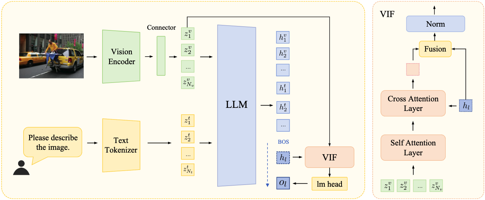

# Vision Inference Former: Sustaining Visual Consistency in Multimodal Large Language Models

## Abstract
In recent years, multimodal large language models (MLLMs) have achieved remarkable progress, primarily attributed to effective paradigms for integrating visual and textual information. The dominant connector-based paradigm projects visual features into textual sequence, enabling unified multimodal alignment and reasoning within a generative architecture. However, our experiments reveal two key limitations:  (1) Although visual information serves as the core evidential modality in MLLMs, it is treated on par with textual tokens, diminishing the unique contribution of the visual modality;  (2) As generation length increases, particularly within a limited context window, the model’s dependence on visual information progressively weakens, resulting in deteriorated vision-language alignment and reduced consistency between generated content and visual semantics. To address these challenges, we propose the Vision Inference Former (VIF), a lightweight architectural module that establishes a direct bridge between pure visual representations and the model’s output space. Specifically, VIF continuously injects visual semantics throughout the decoding phase of the inference process, ensuring that the model remains firmly grounded in visual content during generation. We conduct experiments on 14 benchmark tasks covering general reasoning, OCR, table understanding, vision-centric evaluation, and hallucination. Experimental results show that VIF consistently improves model performance across diverse architectures while introducing minimal additional overhead.

## Run
For environment configuration, please follow [Qwen-VL-Series-Finetune](https://github.com/2U1/Qwen-VL-Series-Finetune)

You can start by running ``scripts/finetune.sh`` with your own data. The main architecture code is located at ``src/train/qwen_vl_re_see_vision_null_token_share_head/modeling_qwen_vl.py``.

## Acknowledgement

This project is based on [Qwen-VL-Series-Finetune](https://github.com/2U1/Qwen-VL-Series-Finetune)
